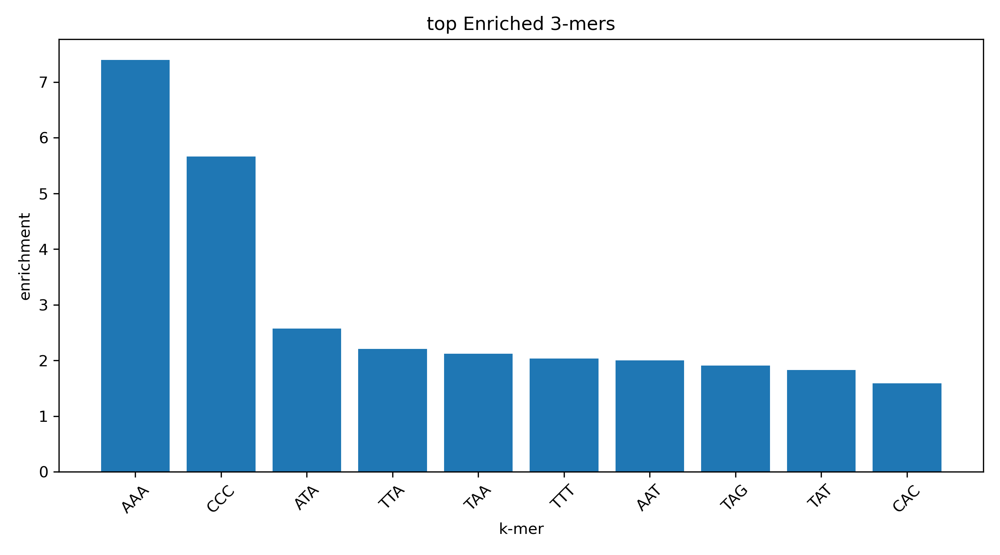
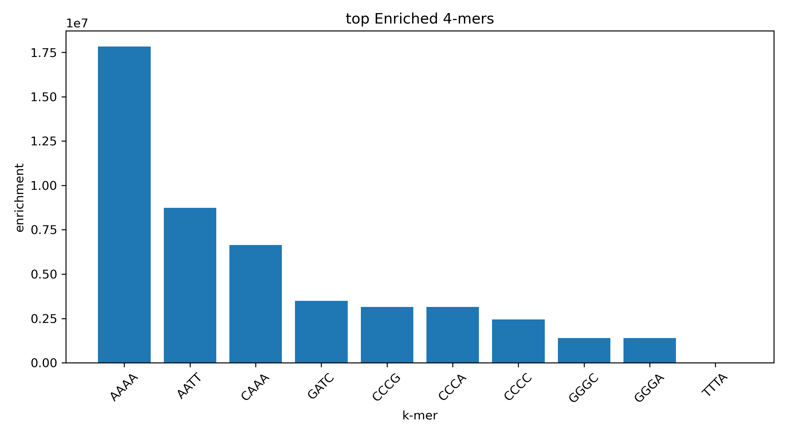
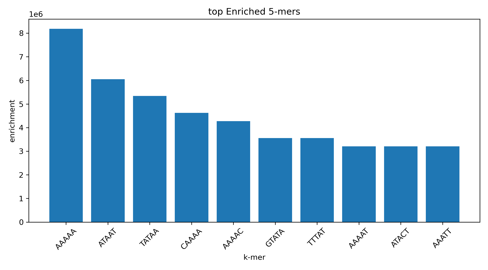
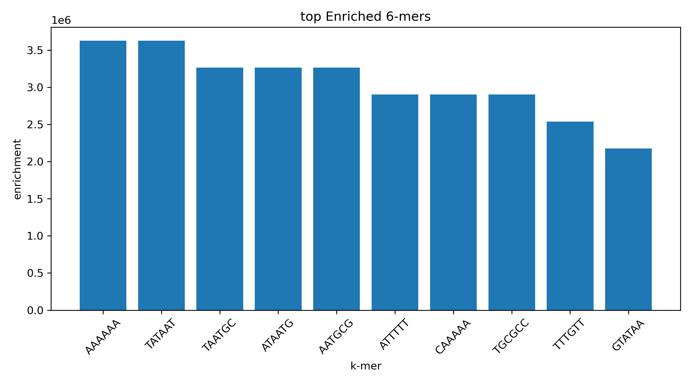

# Promoter k-mer Analysis

A small bioinformatics project for exploring sequence patterns in **promoter and non-promoter DNA sequences** using k-mer frequency analysis and GC content.

The project focuses on understanding nucleotide-level patterns in DNA sequences without using machine learning or deep learning.

---

## Overview

Promoter regions contain sequence patterns that can distinguish them from other genomic regions.

In this project, promoter and non-promoter DNA sequences are analyzed using:

* GC content
* k-mer generation
* k-mer frequency
* k-mer enrichment
* visualization of sequence patterns

The analysis is performed for k-mer sizes from **2 to 6**.

---

## Dataset

The dataset contains **106 DNA sequences** divided into two classes:

* `+` → promoter
* `-` → non-promoter

Each record contains:

```text
label,sequence_name,DNA_sequence
```

Example:

```text
+,S10,tactagcaatacgcttgcgttcggtggttaagtatgtataatgcgcgggcttgtcgt
```

The dataset is stored in:

```text
data/promoter_data.txt
```


---

## Project Structure

```text
promoter-kmer-analysis/
│
├── data/
│   └── promoter_data.txt
│
├── src/
│   ├── __init__.py
│   ├── load_data.py
│   ├── seq_utils.py
│   ├── kmer_analysis.py
│   ├── gc_analysis.py
│   └── statistics.py
│
├── tests/
│   └── test_project.py
│
├── results/
│   ├── kmer_results_k2.csv
│   ├── kmer_results_k3.csv
│   ├── kmer_results_k4.csv
│   ├── kmer_results_k5.csv
│   ├── kmer_results_k6.csv
│   ├── gc_content.csv
│   │
│   └── figures/
│       ├── gc_content.png
│       ├── top_enriched_kmers_k2.png
│       ├── top_enriched_kmers_k3.png
│       ├── top_enriched_kmers_k4.png
│       ├── top_enriched_kmers_k5.png
│       └── top_enriched_kmers_k6.png
│
├── main.py
├── requirements.txt
└── README.md
```

---

## Analysis Methods

### 1. GC Content

GC content represents the percentage of nucleotides that are either **G** or **C**.

It is calculated as:

```text
GC% = (G + C) / sequence length × 100
```

GC content is calculated separately for promoter and non-promoter sequences.

---

### 2. k-mer Generation

A k-mer is a DNA subsequence of length `k`.

For example, for:

```text
ATGCG
```

the 3-mers are:

```text
ATG
TGC
GCG
```

The project analyzes:

```text
k = 2
k = 3
k = 4
k = 5
k = 6
```

---

### 3. k-mer Frequency

For each k-mer size, the frequency of each k-mer is calculated separately for promoter and non-promoter sequences.

This allows nucleotide patterns to be compared between the two sequence classes.

---

### 4. k-mer Enrichment

To compare the two groups, enrichment is calculated as:

```text
Enrichment =
Promoter k-mer frequency /
Non-promoter k-mer frequency
```

An enrichment value greater than 1 indicates that the k-mer occurs more frequently in the promoter group in this dataset.

This is used as an exploratory measure of sequence-pattern differences.

---

# Results

## GC Content

The following figure compares the GC content distributions of promoter and non-promoter sequences.


---

## k-mer Enrichment

The following figures show the top enriched k-mers for different k-mer sizes.

### 2-mers


### 3-mers



### 4-mers



### 5-mers



### 6-mers



---

## Output Files

The analysis generates CSV files containing the calculated results.

### GC content

```text
results/gc_content.csv
```

Contains:

```text
class
gc_content
```

### k-mer results

For each k:

```text
results/kmer_results_k2.csv
results/kmer_results_k3.csv
results/kmer_results_k4.csv
results/kmer_results_k5.csv
results/kmer_results_k6.csv
```

Each file contains:

```text
kmer
promoter_frequency
non_promoter_frequency
enrichment
```

---

## Python Modules

### `load_data.py`

Responsible for:

* reading the dataset
* parsing sequence records
* separating promoter and non-promoter sequences

### `seq_utils.py`

Responsible for:

* DNA sequence validation
* GC content calculation

### `kmer_analysis.py`

Responsible for:

* generating k-mers
* counting k-mers
* calculating k-mer frequencies

### `gc_analysis.py`

Responsible for:

* calculating GC content for multiple sequences
* calculating average GC content

### `statistics.py`

Responsible for:

* calculating k-mer enrichment
* identifying the most enriched k-mers

### `main.py`

The main workflow that connects all components and:

* loads the data
* performs the analyses
* saves CSV results
* generates figures

---

## Installation

Clone the repository and install the required packages:

```bash
pip install -r requirements.txt
```

The project uses:

* Python
* NumPy
* Matplotlib

---

## Running the Analysis

From the project directory:

```bash
python main.py
```

The program will:

1. Load the DNA dataset.
2. Separate promoter and non-promoter sequences.
3. Calculate GC content.
4. Generate k-mers for `k = 2–6`.
5. Calculate k-mer frequencies.
6. Calculate enrichment.
7. Save CSV results.
8. Generate visualization figures.

---

## Testing

Basic unit tests are included in:

```text
tests/test.py
```

Run the tests with:

```bash
python -m pytest
```

---

## Limitations

This project is intended as an exploratory bioinformatics analysis.

The enrichment values should not be interpreted as evidence that a particular k-mer is biologically significant.

The current analysis does not include:
* p-values
* biological motif databases
* machine learning
* deep learning

The dataset is also relatively small, so the observed patterns should be interpreted within the context of this dataset.

---

