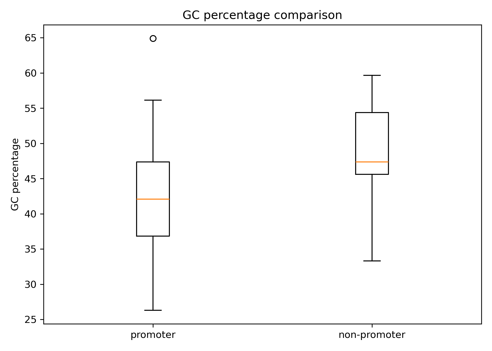
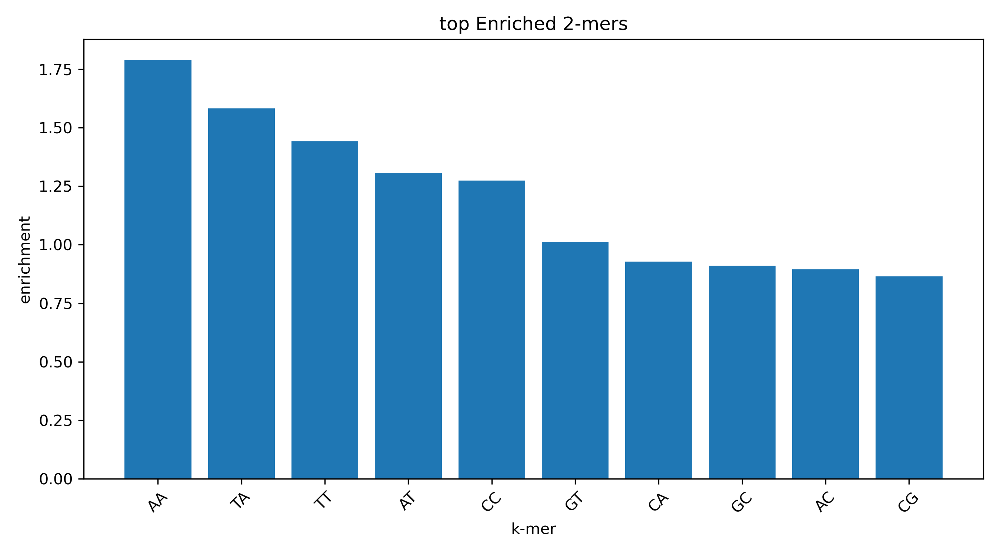

# Promoter k-mer Analysis

Do promoter sequences look different from non-promoter sequences at the level of short DNA "words"? This project explores that question with two simple measures: GC content and k-mer frequencies (k = 2 to 6). There is no machine learning here. The aim was to see what simple counting can and can't show before reaching for a classifier.

## Data

`data/promoter_data.txt` contains 106 *E. coli* DNA sequences, 57 bp each: 53 promoters (`+`) and 53 non-promoters (`-`). This is the "Molecular Biology (Promoter Gene Sequences)" dataset from the UCI Machine Learning Repository.

Each line looks like this:

```text
+,S10,tactagcaatacgcttgcgttcggtggttaagtatgtataatgcgcgggcttgtcgt
```

That is the label, the sequence name and the sequence.

## Method

1. **GC content.** For each sequence, `(G + C) / length × 100`. The two groups are compared with a boxplot.
2. **k-mers.** Every overlapping substring of length k is counted (a 57 bp sequence gives 57 − k + 1 k-mers). Counts are pooled per group and turned into relative frequencies.
3. **Enrichment.** For each k-mer:

   ```text
   enrichment = frequency in promoters / frequency in non-promoters
   ```

   Values above 1 mean the k-mer shows up more often in the promoter group.

## How to run

```bash
pip install -r requirements.txt
python main.py
```

Run it from inside `promoter_kmer_analysis/`, because the paths are relative. It prints summary numbers and writes:

| File | Content |
|---|---|
| `results/gc_content.csv` | GC% of every sequence and its class |
| `results/kmer_results_k{2..6}.csv` | Each k-mer with its promoter frequency, non-promoter frequency and enrichment |
| `results/figures/gc_content.png` | GC% boxplot |
| `results/figures/top_enriched_kmers_k{2..6}.png` | Top 10 enriched k-mers for each k |

Tests:

```bash
python -m pytest tests/test.py
```

## Results

<p align="center">
  
</p>


For short k-mers the result is easy to read. The top 2-mers are AA (about 1.8× more frequent in promoters) and TA (about 1.6×). That fits with promoters being AT-rich and with the TATAAT-like −10 box in bacterial promoters.

<p align="center">
  
</p>


## Limitations

- 53 sequences per class is small, so differences in rare k-mers are mostly noise.
- Enrichment is a plain ratio with no p-values or multiple-testing correction.
- Only the forward strand is counted, so a k-mer and its reverse complement are treated as different words.

## Ideas for improvement

- Use the k-mer counts as features for a simple classifier such as logistic regression with cross-validation, to see how much of the promoter signal they actually capture.
